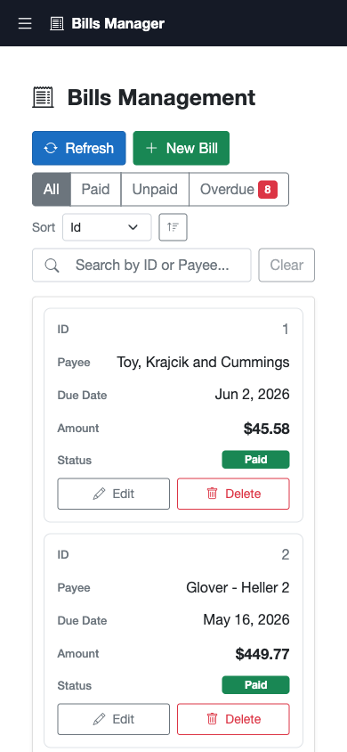
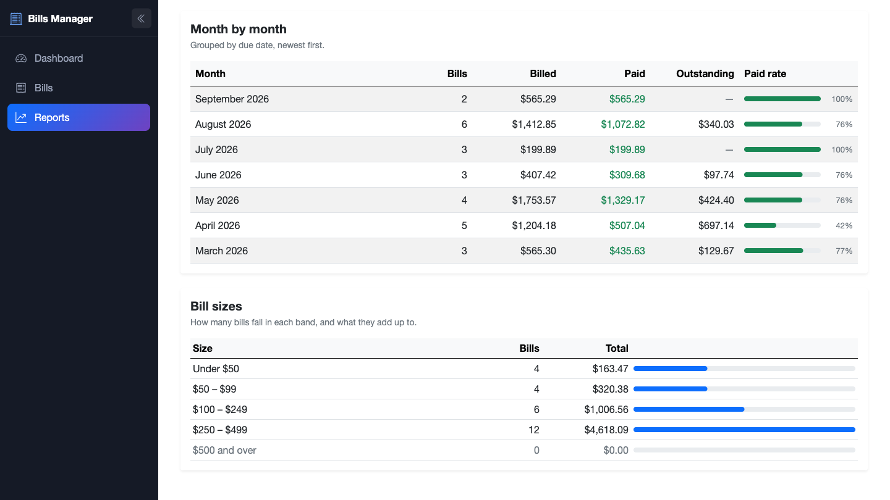

# Bill Management

[](https://github.com/IbrahimKhatibDev/billManagementApi/actions/workflows/ci.yml)

A bill tracking app: an ASP.NET Core Minimal API over PostgreSQL, a Blazor Server
admin UI built on Bootstrap 5 — dashboard, bills table, and a reports page with
CSV export — and an integration test suite that runs against a real database.
Everything runs in Docker, on Apple Silicon and x86 alike, with no emulation.

Accounts are per-user: you sign in, and every bill you see, edit or export is
one of yours. That is enforced by an EF Core global query filter rather than by
a `WHERE OwnerId = ...` remembered at each call site — see
[Authentication](./BillsMinimalApi/README.md#authentication).

**Sign in with `demo@billsapp.dev` / `Demo12345`.** The account is seeded on
first boot and owns the 25 generated bills, so there is something to look at
before you have created anything. It holds nothing but fake data.

## Architecture

```
browser ──▶ blazor :8080 ─┐
                          ├─▶ api :8080 ──▶ db :5432
browser ──▶ react  :80 ───┘   (Minimal API)  (PostgreSQL 16)
```

| Service | Container port | Host port | What it is |
|---|---|---|---|
| `blazor` | 8080 | **5254** | Blazor Server UI (Bootstrap 5) — the maintained frontend |
| `react` | 80 | **5173** | Earlier React client, built to static files and served by nginx |
| `api` | 8080 | **5131** | Minimal API + Swagger |
| `db` | 5432 | **5432** | PostgreSQL 16 |

The two frontends reach the API from opposite sides, which is the one thing worth
understanding about this diagram:

- **Blazor** is Blazor *Server*, so every `BillService` call originates **inside**
  the blazor container and travels the Compose network to `http://api:8080/`. The
  browser holds a SignalR circuit to that container and never talks to the API.
- **React** compiles to static files, so its calls originate **in the browser** and
  have to go to the API's published host port, `http://localhost:5131/`. That is a
  cross-origin request; the API's `AllowAnyOrigin` policy is what lets it through.

So the API's published port is not only for Swagger and `curl` — the React client
depends on it.

Both clients authenticate the same way at the API — a bearer token from
`POST /auth/login` — but they hold it differently, for the same reason the arrows
above point in opposite directions:

- **Blazor** signs you in with a cookie and keeps the API token in a claim inside
  it, because the browser never speaks to the API and so has no use for the token
  itself. `BillService` reads it back out of the circuit's identity on each call.
- **React** stores the token in `localStorage` and an axios interceptor attaches
  it, because the browser *is* the client. A 401 clears it and drops you back to
  the sign-in form.

Getting that token is rate limited to ten attempts a minute per IP and an account
stops answering after five wrong passwords, so both clients can also meet a
**429** on the sign-in form. The demo account is the one exception to the
lockout: its password is printed above, so there is nothing to guess and the
lockout could only serve as a fifteen-minute kill switch for any passer-by. See
[Rate limiting](./BillsMinimalApi/README.md#rate-limiting).

The host ports match the original `launchSettings.json` and Vite defaults, so the
same URLs work whether you are running in Docker or on the host.

Both clients ask the database for what they need rather than for everything:
`GET /restapi/BillDtos` takes `page`, `pageSize`, `search`, `status`, `sort`,
`dir` and a due-date window and returns one page plus a total count, and
`GET /restapi/BillDtos/summary` computes the reports page's figures with EF
`GroupBy`. The query shapes live in `BillsMinimalApi.Contracts`, a small library
both the API and the Blazor app reference, so the client builds its query string
with the same type the server parses it into.

## The UI

The Blazor app: three pages behind a sidebar that collapses to an icon rail on
desktop and to a drawer on mobile — and, in front of all three, a sign-in page.

| Page | Route | What it does |
|---|---|---|
| Sign in | `/Account/Login` | Email and password, or register a new account — the only pages an anonymous visitor can reach |
| Dashboard | `/` | Counters, a paid-vs-unpaid donut, and six months of totals as bars — all hand-rolled inline SVG, all replayed on every load |
| Bills | `/bills` | The CRUD table: sort, filter, search, paginate, toggle paid inline, and create/edit/delete through modals |
| Reports | `/reports` | Headline figures, overdue aging, a payee breakdown, month-by-month totals, and bill-size bands — all scoped to a date preset |

### Dashboard


### Bills


Overdue is derived rather than stored — a bill is overdue when it is unpaid *and*
its due date has passed — so the red rows, the "days late" captions, and the count
on the filter button all fall out of one rule.


Below 768px each row becomes a card instead. The headings are carried across as
`data-label` attributes on the same `<td>` elements, so there is one markup source
for both layouts and they cannot drift apart. The column-header sort control is
replaced by a dropdown, since there are no headers left to click.



### Reports




Reports also exports the current range as CSV. The download is served by the
Blazor app itself at `/reports/bills.csv?range=<slug>`, which re-applies the same
window the page is showing, so an export can never cover a different set of bills
than what you were looking at.

There is no JavaScript of our own anywhere in the Blazor UI — no
`bootstrap.bundle.js`, no charting library, no JS interop. Modals, toasts, charts
and the CSV download are all either component state or plain HTML.

## Prerequisites

- [.NET 10 SDK](https://dotnet.microsoft.com/download) — only needed for `dotnet run` / `dotnet test`
- Docker Desktop (or any Docker engine with Compose v2)

## Run with Docker

```bash
docker compose up --build
```

Then open:

- **UI** — <http://localhost:5254>
- **Swagger** — <http://localhost:5131/swagger>
- **React client** — <http://localhost:5173>

Sign in to any of them with **`demo@billsapp.dev` / `Demo12345`**, or register
your own account — a new one starts with no bills, which is correct but makes for
a duller first look.

The bills endpoints answer **401** without a token, so
<http://localhost:5131/restapi/BillDtos> is no longer something to open in a
browser tab. In Swagger, `POST /auth/login`, copy the `token` out of the
response, and paste it into the green **Authorize** button; every request after
that carries it. With `curl`:

```bash
TOKEN=$(curl -s -X POST http://localhost:5131/auth/login \
  -H 'Content-Type: application/json' \
  -d '{"email":"demo@billsapp.dev","password":"Demo12345"}' | jq -r .token)

curl -s http://localhost:5131/restapi/BillDtos -H "Authorization: Bearer $TOKEN"
```

The API applies EF Core migrations on startup, creates the demo account if it is
missing, and seeds it 25 fake bills if it owns none — so the UI has data on first
load.

To stop and **discard the database volume**:

```bash
docker compose down -v
```

Use `down -v` rather than plain `down` whenever you change a migration — the old
schema otherwise survives in the `pgdata` volume and the new migration fails
against it.

## Run locally

Start only the database in Docker, then run the apps on the host. The default
connection string in `appsettings.json` already points at the published port, so
no extra configuration is needed:

```bash
docker compose up -d db

# terminal 1
dotnet run --project BillsMinimalApi

# terminal 2
dotnet run --project bills-frontend/BillsFrontEndBlazor

# terminal 3 — optional, only if you want the React client too
cd bills-frontend/FrontEndReact && npm install && npm run dev
```

Same URLs as above. Both .NET projects default to their `http` launch profile, so
you do not need `dotnet dev-certs https --trust`. The React client needs no
configuration either — it already defaults to `http://localhost:5131`, which is
where the API listens under both `dotnet run` and Docker.

There is no token signing key to set up either: in Development the API invents a
throwaway one at startup if `Jwt__SigningKey` is unset. The cost is that
restarting the API invalidates every token it had issued, so you sign in again —
which is why `docker-compose.yml` pins a fixed development key instead. Outside
Development a missing key is a startup failure rather than a default, because the
alternative is an app that signs tokens with a secret nobody chose.

> If port 5432 is already taken by a local PostgreSQL, change the `db` port
> mapping in `docker-compose.yml` to `"5433:5432"` and update `Port=` in
> `BillsMinimalApi/appsettings.json` to match.

## Tests

```bash
dotnet test BillsMinimalApi/BillsMinimalApi.sln
```

202 tests in two projects, split by what they need to run:

**137 integration tests** covering the full API surface — CRUD, optimistic
concurrency, validation, UTC round-tripping, the paged list endpoint's paging,
filtering, searching and sorting, the report aggregates, the health probes, the
correlation-ID header, the rate limiter and the account lockout, and the auth
rules: registration and login, 401 without a token, and one user getting **404**
rather than 403 on another user's bill for GET, PUT and DELETE alike. 403 would
confirm the bill exists, which is a thing user B should not be able to learn.

**65 unit tests** over the arithmetic underneath it: the report date presets, the
pager's row numbers, the reports page's derived figures, the query-string writer,
and the UTC normalisation rule. These are the parts an integration test cannot
see — computed properties that never cross the wire, and a `DateTimeKind` branch
whose two halves agree with each other on a machine set to UTC.

```bash
dotnet test tests/BillsMinimalApi.UnitTests   # no Docker, ~20ms
```

**The integration tests need a running Docker daemon.** They use
[Testcontainers](https://dotnet.testcontainers.org/) to start a throwaway
`postgres:16-alpine` and boot the real host against it, because a fake provider
cannot reproduce the `timestamp with time zone` behaviour that most of this
app's date handling depends on. With Docker down you get a connection error from
the container runtime, not a test failure. The unit project references neither
Testcontainers nor a test host, so it is unaffected either way.

The tests bring up their own container, so you do not need `docker compose up`
first — but there is no conflict if it is already running.

## Project layout

| Path | What |
|---|---|
| `BillsMinimalApi/` | Minimal API, EF Core, migrations, Identity + JWT, seeder |
| `BillsMinimalApi.Contracts/` | Query and response shapes shared by the API and the Blazor app |
| `bills-frontend/BillsFrontEndBlazor/` | Blazor Server UI (Bootstrap 5) — the maintained frontend |
| `bills-frontend/FrontEndReact/` | Earlier React frontend |
| `tests/BillsMinimalApi.Tests/` | Integration tests — a real host over a real PostgreSQL |
| `tests/BillsMinimalApi.UnitTests/` | Unit tests — the arithmetic, with no I/O and no Docker |
| `docs/screenshots/` | Images used by these READMEs |
| `.github/workflows/ci.yml` | Build and test on every push and PR |

Both frontends are in the Compose stack, but only the Blazor one has kept pace
with the API — it is where the dashboard, the reports page, and the CSV export
live. The React app is a working plain-CRUD client and a snapshot of an earlier
stage of this project, kept so the repo shows both approaches against the same
backend rather than because it is a second maintained frontend.

## Additional documentation

- [BillsMinimalApi README](./BillsMinimalApi/README.md) — endpoints, database, migrations
- [BillsFrontEndBlazor README](./bills-frontend/BillsFrontEndBlazor/README.md) — UI features, configuration
- [FrontEndReact README](./bills-frontend/FrontEndReact/README.md) — the older React client

## License

[MIT](./LICENSE).
