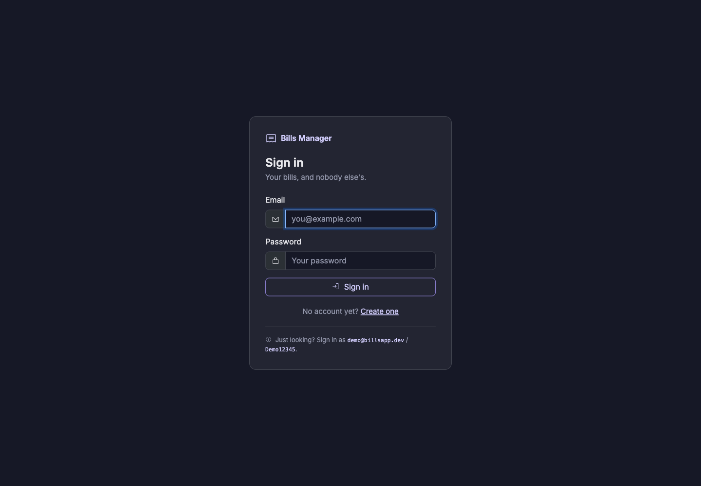
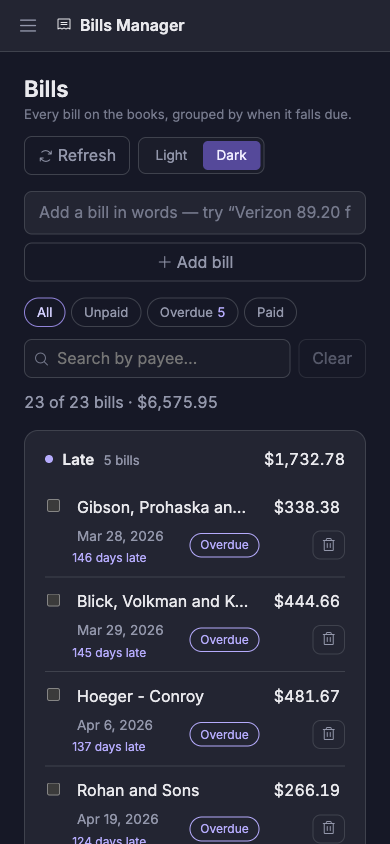

# Bill Management

[](https://github.com/IbrahimKhatibDev/billManagementApi/actions/workflows/ci.yml)

A bill tracking app: an ASP.NET Core Minimal API over PostgreSQL, a Blazor Server
UI — an overview that opens on what you owe, a grouped bills list you edit in
place, and a reports page with CSV export — and an integration test suite that
runs against a real database. Everything runs in Docker, on Apple Silicon and x86
alike, with no emulation.

Accounts are per-user: you sign in, and every bill you see, edit or export is
one of yours. That is enforced by an EF Core global query filter rather than by
a `WHERE OwnerId = ...` remembered at each call site — see
[Authentication](./BillsMinimalApi/README.md#authentication).

**Sign in with `demo@billsapp.dev` / `Demo12345`.** The account is seeded on
first boot and owns the 25 generated bills, so there is something to look at
before you have created anything. It holds nothing but fake data.

## Architecture

```
browser ──▶ blazor :8080 ──▶ api :8080 ──▶ db :5432
                             (Minimal API)  (PostgreSQL 16)
```

| Service | Container port | Host port | What it is |
|---|---|---|---|
| `blazor` | 8080 | **5254** | Blazor Server UI — the frontend |
| `api` | 8080 | **5131** | Minimal API + Swagger |
| `db` | 5432 | **5432** | PostgreSQL 16 |

The one thing worth understanding about that diagram is that the browser never
talks to the API. This is Blazor *Server*: every `BillService` call originates
**inside** the blazor container and travels the Compose network to
`http://api:8080/`, while the browser holds a SignalR circuit to that container
and nothing else. The API's published port is there for Swagger, for `curl`, and
for anything you write against it yourself.

That shapes how the token is held. The Blazor app signs you in with a cookie and
keeps the API's bearer token in a claim inside it, because the browser has no use
for a token it never sends; `BillService` reads it back out of the circuit's
identity on each call.

Getting that token is rate limited to ten attempts a minute per IP and an account
stops answering after five wrong passwords, so the sign-in form can also meet a
**429**. The demo account is the one exception to the lockout: its password is
printed above, so there is nothing to guess and the lockout could only serve as a
fifteen-minute kill switch for any passer-by. See
[Rate limiting](./BillsMinimalApi/README.md#rate-limiting).

The host ports match the original `launchSettings.json`, so the same URLs work
whether you are running in Docker or on the host.

The UI asks the database for what it needs rather than for everything:
`GET /restapi/BillDtos` takes `page`, `pageSize`, `search`, `status`, `sort`,
`dir` and a due-date window and returns one page plus a total count, and
`GET /restapi/BillDtos/summary` computes the reports page's figures with EF
`GroupBy`. The query shapes live in `BillsMinimalApi.Contracts`, a small library
both the API and the Blazor app reference, so the client builds its query string
with the same type the server parses it into.

## The UI

The Blazor app: three pages behind a sidebar that collapses to an icon rail — and,
in front of all three, a sign-in page. Every page carries the same header: the
date it is reasoning from, a Refresh button, and a Light/Dark switch.

| Page | Route | What it does |
|---|---|---|
| Sign in | `/Account/Login` | Email and password, or register a new account — the only pages an anonymous visitor can reach |
| Overview | `/` | What you owe, said in a sentence; how late it is; a cash-flow timeline; and the late bills in a list you can clear from |
| Bills | `/bills` | Every bill, grouped by when it falls due, edited in place |
| Reports | `/reports` | Headline figures, paid rate by month, and who you owe — all scoped to a date preset, and exportable as CSV |

### Sign in



### Overview


The page opens on one number and then explains it in a sentence — how much of the
total is already late, across how many bills, how old the oldest is, and what
falls due in the next 30 days. The figure counts up on load, and the late clause
is coloured because it is the part that needs doing something about.

Overdue is derived rather than stored — a bill is overdue when it is unpaid *and*
its due date has passed — so the headline, the aging strip, the "days late"
captions and the count on the Bills page's filter all fall out of one rule. Every
window on the page is cut from the same "today", read once per render.

Light mode is the same page, not a second design:


### Bills


The list is grouped by when a bill falls due — **Late**, **Later**, **Paid** —
rather than paged, and each group carries its own count and total. Payee, due date
and amount are edited where they sit: click one, type, and the row saves itself.
The status pill asks before it flips a bill between paid and unpaid, because it is
a write that sits under the cursor by accident.

The box at the top takes a bill as a line of text — `Verizon 89.20 fri` — and
`POST /restapi/BillDtos/parse` reads it back to you before anything is created, so
a misread costs a keystroke rather than a row to hunt down. The modal survives
only for a bill you are entering from scratch.

Selecting rows raises a bulk bar above the list, which marks the lot paid in one
call:


### Reports


Reports also exports the current range as CSV. The download is served by the
Blazor app itself at `/reports/bills.csv?range=<slug>`, which re-applies the same
window the page is showing, so an export can never cover a different set of bills
than what you were looking at.

There is no JavaScript of our own anywhere in the Blazor UI — no charting library,
no JS interop, no npm. The charts are hand-rolled inline SVG whose geometry is
computed in `BillsMinimalApi.Contracts` and unit tested away from the renderer;
the modals, toasts, counting animation and CSV download are component state, CSS
and plain HTML.

### On a phone



Every screen works down to 320px. The layouts are driven by container queries
rather than media queries, so a card lays itself out against the width it
actually has — which is not the window's, since the sidebar spends 16rem of the
page and none of the viewport. A cramped column on a desktop gets the same
treatment as a phone. See the [frontend README](bills-frontend/BillsFrontEndBlazor/README.md#-narrow-widths).

## Prerequisites

- [.NET 10 SDK](https://dotnet.microsoft.com/download) — only needed for `dotnet run` / `dotnet test`
- Docker Desktop (or any Docker engine with Compose v2)

## Run with Docker

```bash
docker compose up --build
```

Then open:

- **UI** — <http://localhost:5254>
- **Swagger** — <http://localhost:5131/swagger>

Sign in to either of them with **`demo@billsapp.dev` / `Demo12345`**, or register
your own account — a new one starts with no bills, which is correct but makes for
a duller first look.

The bills endpoints answer **401** without a token, so
<http://localhost:5131/restapi/BillDtos> is no longer something to open in a
browser tab. In Swagger, `POST /auth/login`, copy the `token` out of the
response, and paste it into the green **Authorize** button; every request after
that carries it. With `curl`:

```bash
TOKEN=$(curl -s -X POST http://localhost:5131/auth/login \
  -H 'Content-Type: application/json' \
  -d '{"email":"demo@billsapp.dev","password":"Demo12345"}' | jq -r .token)

curl -s http://localhost:5131/restapi/BillDtos -H "Authorization: Bearer $TOKEN"
```

The API applies EF Core migrations on startup, creates the demo account if it is
missing, and seeds it 25 fake bills if it owns none — so the UI has data on first
load.

To stop and **discard the database volume**:

```bash
docker compose down -v
```

Use `down -v` rather than plain `down` whenever you change a migration — the old
schema otherwise survives in the `pgdata` volume and the new migration fails
against it.

## Run locally

Start only the database in Docker, then run the apps on the host. The default
connection string in `appsettings.json` already points at the published port, so
no extra configuration is needed:

```bash
docker compose up -d db

# terminal 1
dotnet run --project BillsMinimalApi

# terminal 2
dotnet run --project bills-frontend/BillsFrontEndBlazor
```

Same URLs as above. Both projects default to their `http` launch profile, so you
do not need `dotnet dev-certs https --trust`.

There is no token signing key to set up either: in Development the API invents a
throwaway one at startup if `Jwt__SigningKey` is unset. The cost is that
restarting the API invalidates every token it had issued, so you sign in again —
which is why `docker-compose.yml` pins a fixed development key instead. Outside
Development a missing key is a startup failure rather than a default, because the
alternative is an app that signs tokens with a secret nobody chose.

> If port 5432 is already taken by a local PostgreSQL, change the `db` port
> mapping in `docker-compose.yml` to `"5433:5432"` and update `Port=` in
> `BillsMinimalApi/appsettings.json` to match.

## Tests

```bash
dotnet test BillsMinimalApi/BillsMinimalApi.sln
```

398 tests in two projects, split by what they need to run:

**156 integration tests** covering the full API surface — CRUD, optimistic
concurrency, validation, UTC round-tripping, the paged list endpoint's paging,
filtering, searching and sorting, the bulk paid endpoint, the text parser, the
report aggregates, the health probes, the correlation-ID header, CORS, the rate
limiter and the account lockout, and the auth rules: registration and login, 401
without a token, and one user getting **404** rather than 403 on another user's
bill for GET, PUT and DELETE alike. 403 would confirm the bill exists, which is a
thing user B should not be able to learn.

**242 unit tests** over the arithmetic underneath it: the report date presets, the
reports page's derived figures, the query-string writer, the UTC normalisation
rule, the natural-language bill parser, and the geometry behind every chart — bar
heights, the timeline's "now" marker, which month labels survive a crowded axis.
These are the parts an integration test cannot see, and the parts that fail
silently: a bar drawn past its baseline looks like a rendering quirk rather than a
bug.

```bash
dotnet test tests/BillsMinimalApi.UnitTests   # no Docker, ~20ms
```

**The integration tests need a running Docker daemon.** They use
[Testcontainers](https://dotnet.testcontainers.org/) to start a throwaway
`postgres:16-alpine` and boot the real host against it, because a fake provider
cannot reproduce the `timestamp with time zone` behaviour that most of this
app's date handling depends on. With Docker down you get a connection error from
the container runtime, not a test failure. The unit project references neither
Testcontainers nor a test host, so it is unaffected either way.

The tests bring up their own container, so you do not need `docker compose up`
first — but there is no conflict if it is already running.

## Project layout

| Path | What |
|---|---|
| `BillsMinimalApi/` | Minimal API, EF Core, migrations, Identity + JWT, seeder |
| `BillsMinimalApi.Contracts/` | Query and response shapes — and chart geometry — shared by the API, the Blazor app and the unit tests |
| `bills-frontend/BillsFrontEndBlazor/` | Blazor Server UI |
| `tests/BillsMinimalApi.Tests/` | Integration tests — a real host over a real PostgreSQL |
| `tests/BillsMinimalApi.UnitTests/` | Unit tests — the arithmetic, with no I/O and no Docker |
| `docs/screenshots/` | Images used by these READMEs |
| `.github/workflows/ci.yml` | Build and test on every push and PR |

An earlier React client lived under `bills-frontend/FrontEndReact/` and has been
removed. It only ever covered sign-in and a plain CRUD table, it had stopped
keeping pace with the API, and a second frontend that nobody was updating was
worth less than the confusion it cost. The API's CORS policy stayed: it was never
only for that client, and it is what lets anything browser-based call this API
from another origin.

## Additional documentation

- [BillsMinimalApi README](./BillsMinimalApi/README.md) — endpoints, database, migrations
- [BillsFrontEndBlazor README](./bills-frontend/BillsFrontEndBlazor/README.md) — UI features, configuration

## License

[MIT](./LICENSE).
