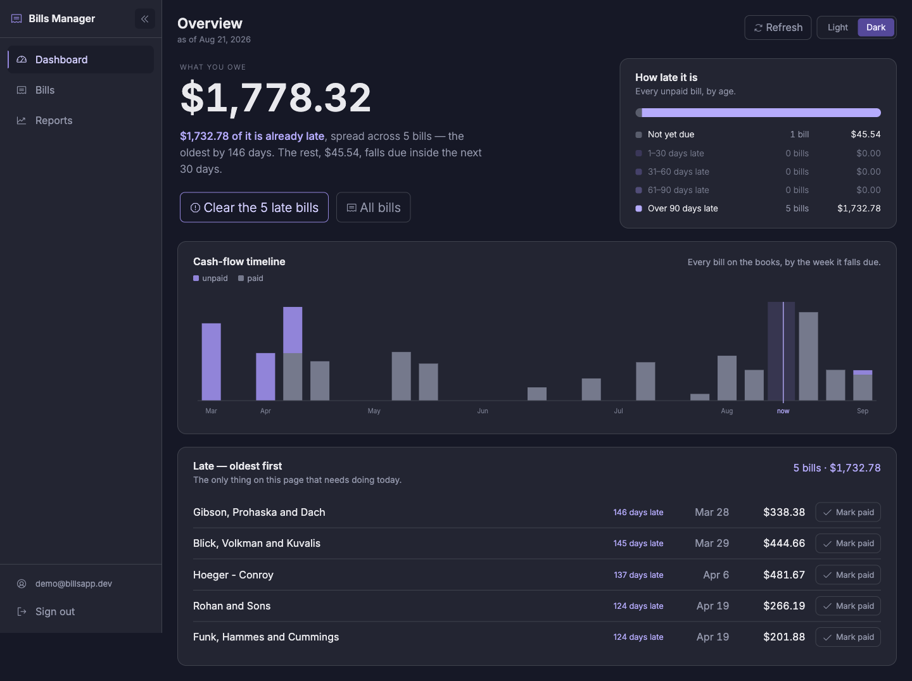
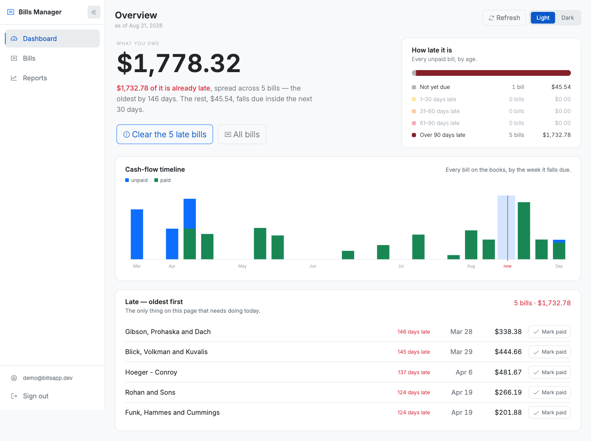
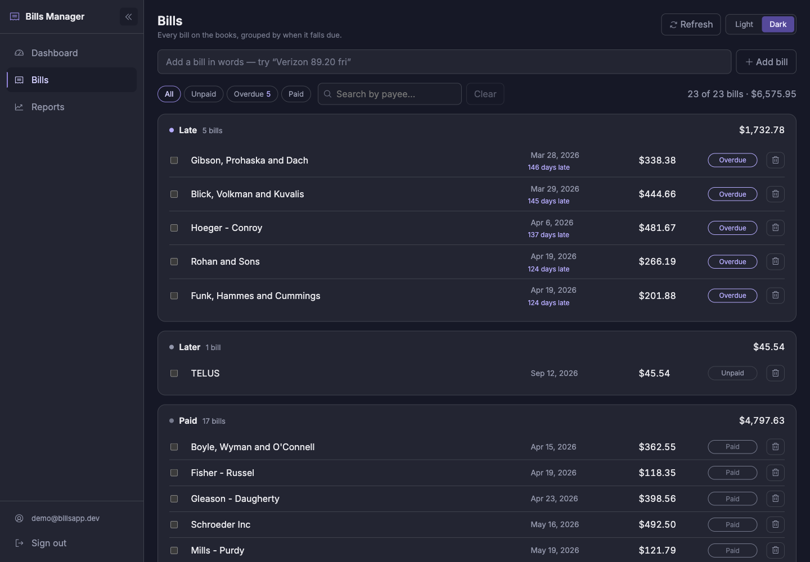
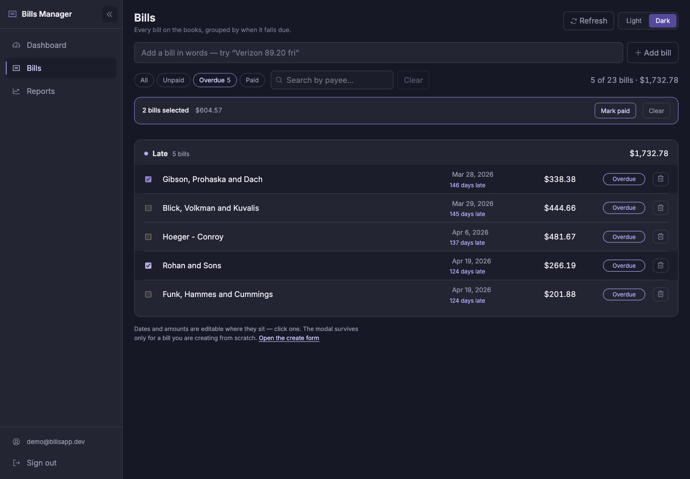
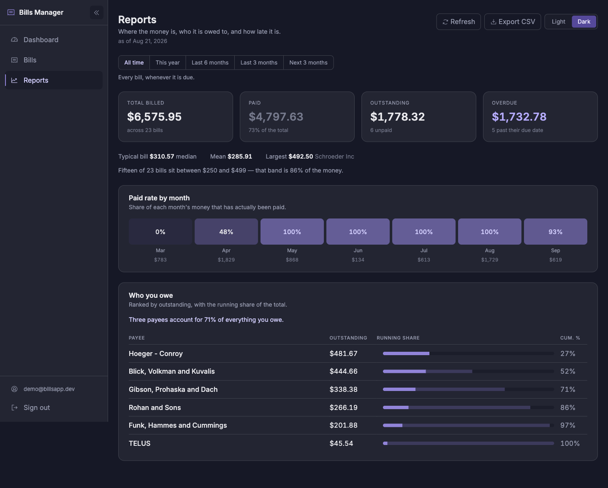

# Bills Manager — Blazor Server

A bill tracking UI built with **Blazor Server** over an **ASP.NET Core Minimal
API**. Three pages — an overview that opens on what you owe, a grouped bills list
you edit in place, and a reports page with CSV export — behind a collapsible
sidebar, and behind a sign-in page: bills belong to the account that created
them, so there is nothing to show until you are somebody.

**Zero external dependencies at runtime.** Bootstrap 5.3 and the Phosphor icon
font are vendored under `wwwroot/css/`, so the project carries no NuGet
`PackageReference` at all and the browser loads nothing from a CDN — check the
Network tab and you will see no third-party requests. The UI renders with the
network off, which is what lets the container run fully self-contained.

There is no `bootstrap.bundle.js` and no npm. Modals are conditional Blazor
markup (`modal fade show d-block` plus a backdrop colour) and toasts work because
Bootstrap hides `.toast` unless it also carries `.show` — both are driven by
component state instead of JavaScript. The charts are hand-rolled inline SVG, the
counting animation is CSS and a `Timer`, and the CSV download is a plain
`<a href>` rather than a JS-built blob.

There is exactly one script of our own, `wwwroot/js/theme.js`, and it is there
because it is the one thing Blazor cannot do. `_Host.cshtml` renders
`ServerPrerendered`, where `IJSRuntime` is unusable until `OnAfterRenderAsync` —
by which time the page has painted. Setting `data-mode` from a component would
therefore flash the wrong theme on every load, so a blocking `<script>` in
`<head>` reads the stored choice and applies it before first paint. Nothing else
here needs interop.

### Colour

Every colour in the app is a token in `wwwroot/css/tokens.css`, defined twice —
once under `:root[data-mode="dark"]` and once under `:root[data-mode="light"]`.
That file is the only place a hex value is allowed to appear; components ask for
`var(--late)` or `var(--surface)` and get whichever mode is current. Light and
dark are therefore the same page rather than two designs to keep in step, and the
Light/Dark switch in the header changes one attribute on `<html>`.

## 🚀 Setup & run

The quickest path is Docker, which brings up the database, the API, and this UI
together — see the [root README](../../README.md). To run this project on the
host instead:

### 1. Clone the repository

```bash
git clone https://github.com/IbrahimKhatibDev/billManagementApi.git
cd billManagementApi
```

### 2. Start the database

```bash
docker compose up -d db
```

### 3. Run the backend API

```bash
dotnet run --project BillsMinimalApi
```

Listens on <http://localhost:5131>.

### 4. Run the frontend (Blazor Server)

In a second terminal, from the repo root:

```bash
dotnet run --project bills-frontend/BillsFrontEndBlazor
```

Then open <http://localhost:5254> and sign in with **`demo@billsapp.dev` /
`Demo12345`** — the account the API seeds, which owns the 25 generated bills.

Both projects default to their `http` launch profile, so no HTTPS development
certificate is needed.

## ⚙️ Configuration

One setting, in `appsettings.json`:

```json
"BillsApi": {
  "BaseUrl": "http://localhost:5131/"
}
```

**The trailing slash is required.** `BillService` issues relative requests
(`restapi/BillDtos`), and `new Uri(baseAddress, "restapi/BillDtos")` only
resolves correctly when the base address ends in `/`. Drop it and the app starts
cleanly but every table comes up empty.

Docker Compose overrides the value with `BillsApi__BaseUrl=http://api:8080/`.
The URL is resolved over the Compose network rather than from the browser: this
is Blazor **Server**, so every `BillService` call originates inside this
container. Startup fails fast with a clear message if the setting is missing.

`Program.cs` also pins the culture to `en-US`. The container's default is the
invariant culture, where `decimal.ToString("C")` renders `¤42.50` instead of
`$42.50` — so without the pin every amount in the app formats differently in
Docker than on a developer machine.

## 🔐 Signing in

**Demo account: `demo@billsapp.dev` / `Demo12345`.** The login page prints it,
so nobody has to find this file first. Registering works too, and gets you an
account with no bills — correct, and a duller first look.

Three Razor Pages under `Pages/Account/`, not Blazor components:
`Login`, `Register`, and `Logout`. They have to be pages, because signing in
means calling `HttpContext.SignInAsync`, and a live Blazor circuit has no
`HttpContext` to write a `Set-Cookie` header to. They share `_AccountLayout`,
which has no sidebar — there is nothing to navigate to yet.

`Logout` is a page with a confirmation and a POST rather than a link, so a
prefetch or a stray `GET` cannot sign anyone out.

### Two schemes, one sign-in

The browser and the API want different credentials, so the sign-in produces
both:

- The **browser** gets an encrypted, HttpOnly cookie — something it sends
  automatically on every navigation and cannot read from script.
- The **API** needs the stateless bearer token it issued, which it can validate
  without a session store.

`CookieSignIn` puts the second inside the first, as a claim named
`bills:api_token`. So "who is signed in" and "which token do we send" are
answered by the same object and cannot drift apart — and the JWT never reaches
the browser in a form anything can read.

The cookie is issued with **the token's own expiry**, and `SlidingExpiration` is
off. That setting is load-bearing: sliding would keep renewing the cookie past
the token's life, leaving somebody who looks signed in holding a token the API
has stopped accepting — a session that is authenticated everywhere except where
it needs to be. `SameSite=Lax` rather than `Strict`, so following a bookmark or
an inbound link does not land on the login page while already signed in.

### Reading the token back

`ApiTokenAccessor` finds it, and looks in two places because this app renders in
two worlds:

- **`IHttpContextAccessor`** — the prerender pass and the `/reports/bills.csv`
  endpoint, which are ordinary HTTP requests with no circuit.
- **`AuthenticationStateProvider`** — a live SignalR circuit, which has no
  `HttpContext` at all.

`GetAuthenticationStateAsync` *throws* rather than returning an anonymous user
in a scope that is neither, so the second lookup is wrapped in a `catch` that
treats it as "no token", which is what it is.

A `DelegatingHandler` on the typed client would have been the tidier place for
this and does not work: `IHttpClientFactory` builds handler chains in a scope of
its own, so a handler injecting a scoped circuit service gets a different scope
than the circuit it is serving. Constructor injection into `BillService` resolves
correctly, because the typed client is activated from the calling scope.

`ApiAuthClient` is separate from `BillService` and has its own `HttpClient`,
because it is the one caller that must send requests *without* a token: it is how
the token is obtained.

### What is actually closed

`_Host.cshtml` carries `@attribute [Authorize]`, which covers the whole
component app — every Blazor route renders through that one page. Both routes
into it also say so out loud (`MapRazorPages` for `/`, and
`MapFallbackToPage("/_Host").RequireAuthorization()` for everything else),
because a fallback that renders the entire app is worth being able to check
without opening another file.

The CSV endpoint gets its own `.RequireAuthorization()`: it is a minimal-API
endpoint rather than a page, so `[Authorize]` on `_Host` does not reach it — and
without that line it would be a way to read somebody's whole bill list by URL.

`App.razor` wraps the router in `CascadingAuthenticationState` and uses
`AuthorizeRouteView`, whose `<NotAuthorized>` block is reachable in exactly one
situation: the cookie expired while the circuit was still open. Redirecting from
a component there would be a client-side navigation that never touches the
server's login path, so it says what happened and lets a reload do the work.

The sidebar's account block is an `<AuthorizeView>` with no `<NotAuthorized>`
half — nothing renders that menu unless you are signed in. Sign out is a
`<button>` calling `NavigateTo(..., forceLoad: true)` rather than an anchor:
Blazor's router intercepts same-origin anchor clicks and looks for a matching
*component* route, and `/Account/Logout` is a Razor Page, so a plain link would
render "nothing at this address" without ever asking the server.

## 🚀 Features

### 🖥️ Overview (`/`)



The page answers one question and then explains its own answer:

- **What you owe** — one figure, counted up on load by `AnimatedCounter`, and
  under it a sentence built by `ObligationSentence`: how much is already late,
  across how many bills, how old the oldest is, and what falls due in the next 30
  days. The late clause is coloured, because it is the part that needs doing
  something about
- **Two links, not a menu** — straight into the overdue filter on Bills, or the
  whole list
- **How late it is** — every unpaid bill bucketed by age (not yet due, 1–30,
  31–60, 61–90, over 90 days) as a single stacked strip with a legend carrying
  counts and totals
- **Cash-flow timeline** — every bill on the books as weekly stacked bars, paid on
  the baseline and unpaid riding on top, with a marker for today and one label per
  month
- **Late — oldest first** — the late bills as a list you can clear from, each row
  carrying its own *Mark paid*

Everything on the page is cut from one "today", read once per render, so no two
sections can disagree about where the boundary falls.

The charts are hand-rolled inline SVG rendered from C#, so there is no JS interop
and nothing fetched over the network. Their geometry is not computed here, though:
`TimelineLayout`, `StackedStrip` and `WeekBuckets` live in
`BillsMinimalApi.Contracts` — the one assembly this app and the unit test project
share — precisely so the arithmetic can be tested away from the renderer. A bar
drawn past its baseline or a "now" marker in the wrong week looks like a
rendering quirk rather than a bug, which is exactly how that class of error
ships. The axis rounds up to 1, 2 or 5 times a power of ten, the same ladder
charting libraries use, so the labels read as money at any data scale.

Light mode is the same page — the tokens change, nothing else does:



### 📄 Bills (`/bills`)



The list is **grouped by when a bill falls due** — Late, Later, Paid — rather than
paged, each group carrying its own count and total. There is no pager and there
are no sortable headers: the page asks the server for one page at
`BillQuery.MaxPageSize` in due-date order and groups what comes back, because the
grouping *is* the sort and a second ordering control would only let the two
disagree.

- **Add a bill in words** — `Verizon 89.20 fri` goes to
  `POST /restapi/BillDtos/parse`, which reads the line back to you *without*
  creating anything. You correct the reading, and the bill is created through the
  ordinary `POST` — so a misread costs a keystroke rather than a row to hunt down
- **Edit in place** — payee, due date and amount are `InlineEdit` fields: click
  one, type, and the row saves itself. The create modal survives only for a bill
  you are entering from scratch
- **The status pill asks first** — it flips a bill between paid and unpaid, which
  is a write sitting where the cursor lands by accident, so the first click arms
  it and the second commits
- **Bulk actions** — select rows and a bar appears *above* the list, showing the
  count and total and marking the lot paid in one call. It sits above rather than
  below because it acts on what is under it
- **All / Unpaid / Overdue / Paid filters** with a live overdue count, plus
  free-text search on payee
- **Toasts** for every write, **loading indicators** during every API call, and a
  reload that dims the list rather than blanking it
- Errors surface as a toast plus an inline retry rather than tearing down the
  circuit

Filtering, searching and the due-date ordering are query-string parameters on
`GET /restapi/BillDtos`, so Postgres does that work rather than this page. Two
things follow:

- **The search box is debounced by 300 ms.** Every keystroke is a database query
  otherwise.
- **Responses can arrive out of order.** A slow request landing after a fast one
  would put the wrong rows on screen, so each load takes a generation number and
  a response that is not the newest is dropped.

Selecting rows, with the bulk bar above them:



Concurrent writes are kept off each other: a bill already being written by its own
row is excluded from the bulk call, so the two paths cannot race on the same row.

### 📊 Reports page (`/reports`)

Everything on this page is scoped to one date window, picked from presets — All
time, This year, Last 6 months, Last 3 months, Next 3 months — with a caption
spelling out the exact dates, because "Last 6 months" alone does not say whether
today is in it.



- **Four headline figures**: total billed, paid, outstanding and overdue, each
  with a note underneath saying what it is made of. They count up on load and
  replay whenever the range changes
- **The typical bill** — median, mean, and the largest with its payee. Median
  first, because a single large bill drags the mean somewhere no bill actually is
- **Bill sizes as a sentence** — "Fifteen of 23 bills sit between $250 and $499 —
  that band is 86% of the money." A chart of the bands was a lot of ink for one
  fact
- **Paid rate by month** — the share of each month's money that has actually been
  paid, one block per month with the month's total underneath
- **Who you owe** — every payee ranked by outstanding, with a running share of
  the total and a sentence naming how few payees account for most of it
- **CSV export** of the current range

Bills with no due date cannot be placed on a timeline, so any bounded window
drops them — and the page says how many it left out rather than quietly
under-reporting.

Presets rather than a pair of date pickers: every section has to agree on one
window, and a free-form range gives a hundred ways to ask a question nobody asks.

### 📥 CSV export

The Export CSV button is a plain `<a href="reports/bills.csv?range=..." download>`
pointing at a Minimal API endpoint mapped in this app's own `Program.cs`. It
re-parses the range through the same `ReportRanges` helper the page uses, so an
export can never cover a different set of bills than the page it was downloaded
from.

That endpoint hands the window to the API rather than filtering a list here: the
list endpoint pages, so "download everything and filter it" would export the
first ten bills. `BillService.GetAllInRangeAsync` walks the pages at the maximum
page size and the database does the filtering and the ordering.

The file is RFC 4180 with CRLF line endings and a UTF-8 BOM — Excel on Windows
otherwise decodes it as the system code page and mangles any payee name that is
not pure ASCII. Dates go out as ISO `yyyy-MM-dd` and amounts as bare numbers, so
a spreadsheet parses and sums them instead of treating `$1,234.56` as text. Payee
names are quoted when they need to be; "Sanford, Turcotte and Farrell" unquoted
would silently shift every later column of that row by one.

### 📱 Narrow widths

The shell handles them. Below 641px the sidebar becomes an overlay drawer, the
bulk action bar stacks, and the timeline drops to a shorter aspect; the Overview
collapses to a single column below 900px.

**The bills rows do not, and this is a known gap.** `BillGroup.razor.css` lays a
row out as `grid-template-columns: 1.1rem 1fr 11rem 7rem 5.5rem auto`, and there
is no media query for it. Below roughly 430px the fixed columns consume the whole
row, the payee's `1fr` collapses to a sliver, and the status pill and delete
button end up outside the card. The card layout the old Bootstrap table used at
phone widths was not carried across when the table was replaced by this grid.

### 🧭 Sidebar navigation

Two independent behaviours, because the sensible defaults at the two breakpoints
disagree:

- **Wide** — always on screen, collapsible to an icon rail. Collapsed, each
  icon's `title` names its destination
- **Narrow** — an overlay drawer that starts closed, opens from a hamburger in
  the top bar, and closes on navigation or on a tap outside

### 🔄 Real-time UI updates

A custom **BillEventService** notifies pages when bills change — event-driven, no
polling and no timers. Every page subscribes, so a bill created on one page
updates the others without a manual reload, and publishing once is enough because
the publishing page is a subscriber too.

### 🏗️ Backend API

A RESTful ASP.NET Core Minimal API (`/restapi/BillDtos`) supporting GET, POST,
PUT, and DELETE. See the [API README](../../BillsMinimalApi/README.md).

No call from this app passes an owner. Bills are scoped server-side by an EF
Core global query filter, so `BillService` asks for "the bills" and gets the
signed-in user's — and a request for a bill belonging to somebody else comes
back **404**, which `BillService` already handles as "it's gone".

Writes go through `BillService`, which returns a `BillWriteResult` rather than a
bool: the UI has to say something different for "you lost a race, reload" (409,
which the API returns when the concurrency token is stale), "bad input" (400),
"it's gone" (404), and "the API is unreachable". A 409 or 404 also triggers a
refresh, because whatever is on screen is now wrong.

## 🧩 Tech stack

### Frontend

- **Blazor Server (.NET 10)**
- **Bootstrap 5.3.8**, the **Phosphor** icon font and **Inter**, all vendored
  under `wwwroot/` — no NuGet packages, no CDN, no npm
- **Design tokens** in `wwwroot/css/tokens.css`; component styles are scoped
  `.razor.css` files
- **Blazor `EditForm` validation**
- **Event-driven updates using a pub/sub service**
- **One script of our own**: `wwwroot/js/theme.js`, and only because the theme
  has to be on the `<html>` element before first paint
- Charts are hand-rolled inline SVG — no charting library, and no JS interop
  anywhere else

### Backend

- **ASP.NET Core Minimal API (.NET 10)**
- **HttpClient-based `BillService`**
- **Cookie authentication**, carrying the API's JWT as a claim — Razor Pages for
  sign-in, `[Authorize]` on `_Host` for everything else
- **`BillsMinimalApi.Contracts`** — query and response shapes referenced by both
  this app and the API, so `BillQuery` writes the query string that the endpoint
  parses back into a `BillQuery`

---

## 📡 Event-driven updates

A scoped service notifies components:

```csharp
public class BillEventService
{
    public event Action? OnBillsChanged;
    public void NotifyBillsChanged() => OnBillsChanged?.Invoke();
}
```

Scoped, not singleton. In Blazor Server, scoped means per-circuit — one browser
tab — which is the intended semantics here. As a singleton it would fire
`OnBillsChanged` on every connected circuit and hold references to components
from circuits that had already ended.

`ToastService` is scoped for the same reason: it holds the live toast list and
raises `OnToastsChanged`, which `ToastHost` renders as Bootstrap `.toast` markup
from `MainLayout` — outside `@Body`, so a toast survives navigation between
pages. Toasts dismiss themselves after four seconds.

---

## ✅ What is here

- [x] Sign in, register and sign out — cookie auth carrying the API's bearer
      token, with every page and the CSV endpoint closed to anonymous visitors
- [x] Overview built around one sentence: what you owe, how much of it is late,
      how old the oldest is, what lands in the next 30 days
- [x] Overdue as a derived first-class state — filter, count, aging strip,
      relative due dates
- [x] Bills grouped by when they fall due, with per-group counts and totals
- [x] Inline editing of payee, due date and amount
- [x] A status pill that arms before it commits, so a stray click cannot flip a
      bill
- [x] Natural-language add box, parsed server-side and shown back before anything
      is created
- [x] Multi-select with a bulk action bar above the list
- [x] Reports — headline figures, the typical bill, size bands, paid rate by
      month, and who you owe
- [x] CSV export of the selected report range
- [x] Light and dark, chosen at the top of every page and applied before first
      paint
- [x] Counting animation on the Overview figure, replayed on every refresh
- [x] Toasts for every write, and loading indicators during API calls
- [x] Collapsible sidebar rail, and an overlay drawer at narrow widths

**Removed by the redesign**, so that a reader coming from an older revision is
not looking for them: sortable table headers, the pager, the sort dropdown, the
paid-vs-unpaid donut, and the phone card layout for the bills table. Sorting and
paging still exist in the API — see `BillQuery` — the list page simply asks for
one full page ordered by due date and groups it.

**Known gap**: the bills rows have no narrow-width handling. See
[Narrow widths](#-narrow-widths).
